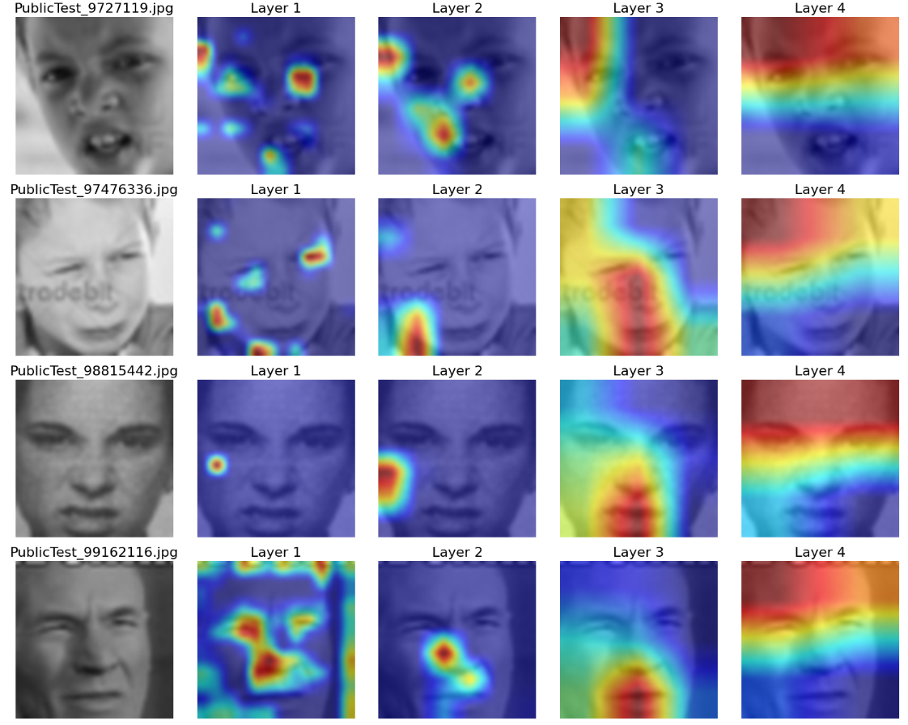

# Heat‑Map‑Based Model Interpretation

> Here I present a lightweight, reproducible workflow for training image‑classification models **and** visualising interpretation (two methods) by heatmap for classification results.  
> The repo bundles **Grad‑CAM**, **self‑attention maps**, and a tidy training/evaluation loop in one place, making it easy to move from **raw data → trained model → human‑readable heat map**.

---

## ✨ Key Features
| Module | Purpose | What you’ll find |
|--------|---------|------------------|
| `train.ipynb` | End‑to‑end training notebook | Data loading, augmentation pipeline, configurable CNN architectures, metrics tracking |
| `gradcam.ipynb` | Visual explanation notebook | Class‑specific Grad‑CAM heat‑maps over input images |
| `attentionMap.ipynb` | Transformer‑style attention visualiser | Self‑attention weight extraction & overlay |
| `models/` | Saved PyTorch models | Checkpoints, JSON‑style config files |
| `img/` | Demo images & generated heat‑maps | Use these to sanity‑check your setup |
| `data/` | *Put your dataset here* | Folder is `.gitignore`‑protected to avoid huge commits |

---
